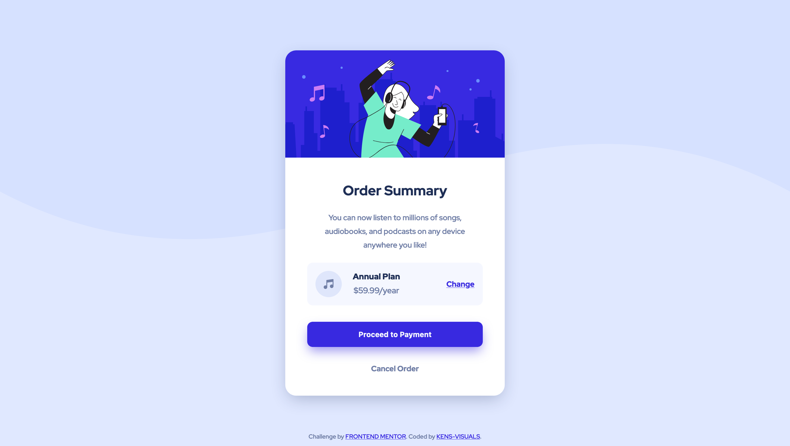

# Frontend Mentor - Order Summary Card Solution

This is a solution to the [Order summary card challenge on Frontend Mentor](https://www.frontendmentor.io/challenges/order-summary-component-QlPmajDUj).

## Table of contents

- [Overview](#overview)
  - [The challenge](#the-challenge)
  - [Screenshot](#screenshot)
  - [Links](#links)
- [My process](#my-process)
  - [Built with](#built-with)
  - [Continued development](#continued-development)
  - [Useful resources](#useful-resources)
- [Author](#author)

## Overview

### The challenge

Users should be able to:

- See hover states for interactive elements

### Screenshot

### Links

- Solution URL: [https://www.frontendmentor.io/solutions/basic-card-component-using-sass-preprocessor-and-bem-naming-convention-029xmfY6X](https://www.frontendmentor.io/solutions/basic-card-component-using-sass-preprocessor-and-bem-naming-convention-029xmfY6X)
- Live Site URL: [https://kens-visuals.github.io/order-summary-component/](https://kens-visuals.github.io/order-summary-component/)

## My process

### Built with

- Semantic HTML5 markup
- SCSS variables
- CSS Flexbox

### Continued development

For the next project with more complex layout, I want to experiment with mobile first approach.

### Useful resources

- [CSS Box-Shadow Generator](https://html-css-js.com/css/generator/box-shadow/) - This helped me for generating box-shadows without going back and forth between the editor and the browser
- [CSS-TRICKS](https://css-tricks.com/) - No matter if you are a junior or senior developer, CSS-TRICKS is always a good idea.

## Author

- Frontend Mentor - [@kens-visuals](https://www.frontendmentor.io/profile/kens-visuals)
- Codewars - [@kens_visuals](https://www.codewars.com/users/kens_visuals)
- CodePen - [@kens-visuals](https://codepen.io/kens-visuals)
